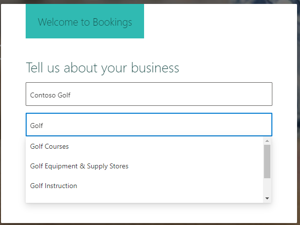
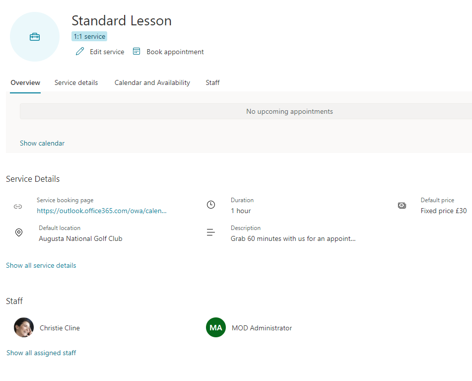
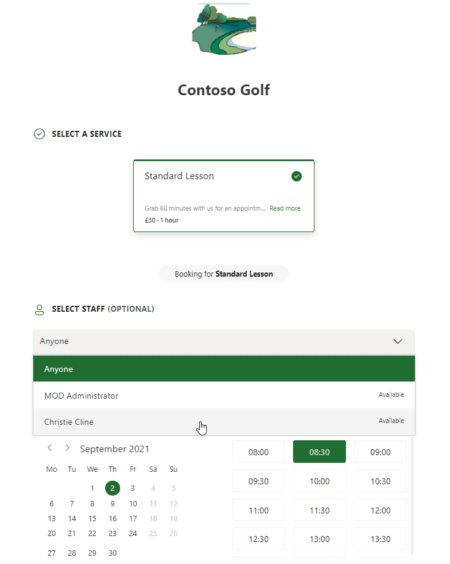
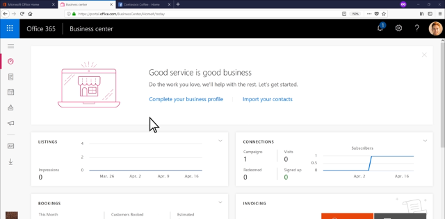

## M365 Bookings

Microsoft bookings allows you to create a company calendar that clients (or potential clients) can use to book your services or an appointment. 

Imagine you are a busy Golf instructor with many students, and you sell 1 or 2 hour lesson blocks. Bookings allows you to showcase your offerings along with the price, and let the students book around your availability. You set your own hours, minimum booking notice period and Bookings deals with the rest - and it also won't allow clashes.

[O365 Bookings](https://outlook.office.com/bookings)

When I head to that link I'm prompted to create a new bookings calendar

I'm able to create the service and add the employees that can take the bookings, which will also take into account the availability from their normal calendar and not allow clashes.

Then I can publish my link which my customers can use.

#### Custom Fields

You are also able to add custom fields that are required by the customer. In my golf example I've asked customers to specify their handedness.

The bookings portal is very visual and is perfect for simple a simple self-service option to allow customers to book your time.

#### Watch the Microsoft Overview
