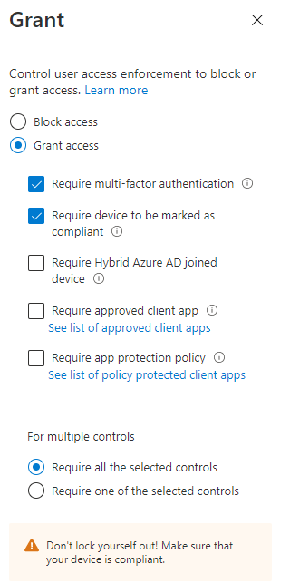
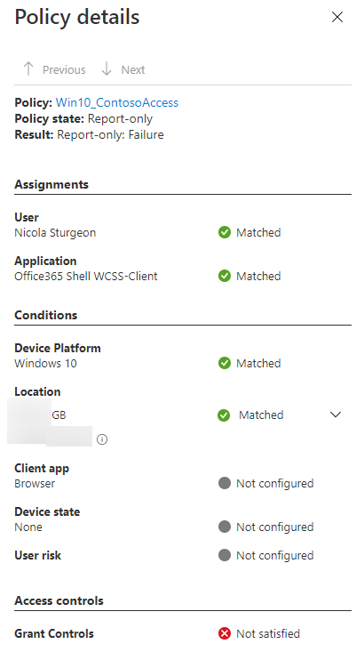

## You shall pass, if you meet my conditions... 🙏

Azure AD Conditional Access is something that everyone should have enforced. It is essential for managing access to resources.

### An example 📖

Contoso only wants to allow access to company email on devices that are owned by the company, providing that users can also pass MFA challenge.

We'd go ahead and create a policy that applies to all users on all devices, with grant controls as shown below:

If you're creating a policy for the first time, having *Report Only* enabled is a good place to start. You can evaluate the intentions of your policy by viewing the sign-in logs located at Users -> Sign-In logs

In my example it failed as the device was not compliant, if this policy was enabled, the user would be refused access.

Get started with this [Direct Link](https://aad.portal.azure.com/#blade/Microsoft_AAD_IAM/ConditionalAccessBlade/Policies).

## Multi-Factor Authentication

Microsoft currently has a few different ways of enforcing MFA across an organization, although the most comprehensive way to enforce it is via a Conditional Access policy.

⚠️ If MFA is all you want, create a policy that enforces it. Although you really should be doing more to restrict access to compliant, work owned devices only. Ignoring this creates all sorts of Data Loss Prevention troubles...

>💡 Ticking _Require device to be marked as compliant_ will only allow Azure AD joined devices to meet the criteria.