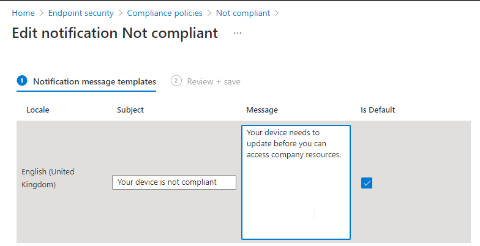
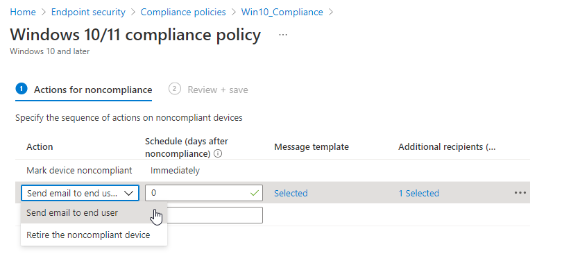

## Device Compliance Policies 📚

Configuring a compliance policy allows you to keep track of your device standards, and can be used in conjunction with [Conditional Access](ConditionalAccess.md) to prevent non-compliant devices accessing company resources.

#### Scenario

You have a Windows 10 update ring deployed, and you only want devices with the latest updates from accessing company data. You also want the OS drive to have Bitlocker encryption enabled.

Head to the Compliance Policies blade and create a policy with the following settings:

- Minimum OS Version: 10.0.19041.329
- Require encryption of data storage on device: Require

To enforce this with Conditional Access, specify a policy that applies to Windows 10 Devices and under *Grant*, select *Require device to be marked as compliant*.

Devices that don't meet this criteria will be marked as non-compliant, and the Conditional Access requirements will fail.

### Getting notified

While logging on to view dashboards is nice every now and then, you want to automate the initial remediation to get your devices compliant again.

From the Device Compliance blade, select notifications. Here you can create a custom email template that can be sent both to the end user and IT administrators (for example) when a device becomes non-compliant.

The notification might look like this:

Once you've created your template, you need to add it as an action when your custom compliance policy fails:

Learn more on [MS Docs](https://docs.microsoft.com/en-us/mem/intune/protect/device-compliance-get-started)