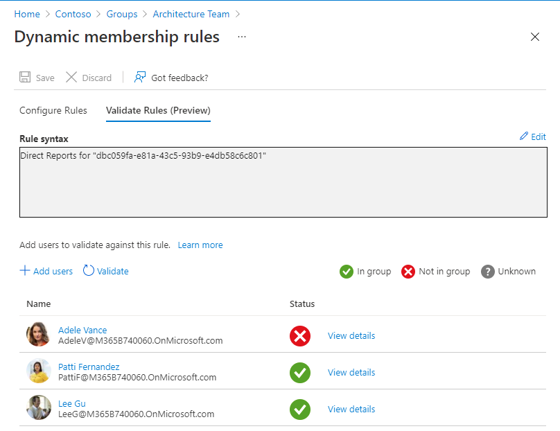

## Dynamic Groups 🤹

Azure AD Groups allow you to manage user access to resources in user groups. Pretty simple.

A Dynamic Group is one where membership is controlled by a set of query conditions.

Let's say you have an Architecture Team SharePoint site which will already have a corresponding Azure AD group called "Architecture Team". It will be a Microsoft 365 group and by default the membership type will be set to *Assinged*. This means you have to manually add people into this group.

Patti is the manager of the Architecture Team group, and everyone who reports to Patti should have access to the SharePoint site. Changing the membership type to Dynamic unlocks the ability to write a query to add members. 

> ⚠️ Once a group is set to Dynamic, you cannot manually add users. Your query has to perfectly match your desired membership criteria

Our dynamic group query in this case is

```
Direct Reports for "dbc059fa-e81a-43c5-93b9-e4db58c6c801"
```
(The string is the Azure AD object ID for the manager.)

Once your rule is built you can validate it with some test users



There are countless query rules you can write to meet your needs. A useful one that comes to mind that I have used is:

 *Any user that has an active Exchange Online license and NOT a guest... Got access to company intranet.*

The query for that scenario is shown below
```
(user.assignedPlans -any (assignedPlan.servicePlanId -eq "9aaf7827-d63c-4b61-89c3-182f06f82e5c" -and assignedPlan.capabilityStatus -eq "Enabled")) -and user.UserType -eq "Member"
```

>[Service Plan IDs](https://docs.microsoft.com/en-us/azure/active-directory/enterprise-users/licensing-service-plan-reference) - You want the ID listed in the far right column.

Using Dynamic groups will save your team time when creating/removing  users and limits  oversights made when carrying out their tasks.

[More info on MS Docs](https://docs.microsoft.com/en-us/azure/active-directory/enterprise-users/groups-dynamic-membership)