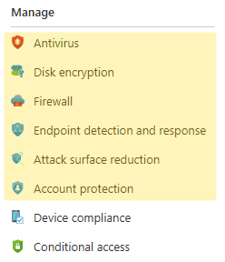

## Endpoint Security ☂️

With the shift to hybrid working, security is more important than ever. Luckily, Microsoft have set some baselines for easy deployment to ensure your organization and its users are protected.

During our [Autopilot](autopilot.md) overview we discussed how to deploy user machines without them being added to the Local Administrators group. 

> ⚠️ Ensuring that all staff in the business are signed in with a standard user account should be your top priority when it comes to device security. Even for your own work PC.

### Baseline Settings ✅

The latest Microsoft created baseline is *MDM Security Baseline for Windows 10 and later for December 2020*. You can create a profile which uses these defined settings as a template.

I do not recommend simply hitting apply on this baseline. You should read each setting carefully and test the outcome on a VM if necessary before enforcing on your endpoints. I also can't recommend what you should change.

Microsoft have set the baseline, and it's up to you to decide if and how you wish to use it. The alternative approach would be to configure each setting manually using the other controls. Personally, I just tweak the baseline as it covers each section with some assumed settings.

Read more about the Baseline on [MS Docs](https://docs.microsoft.com/en-us/mem/intune/protect/security-baseline-settings-mdm-all?pivots=mdm-december-2020)