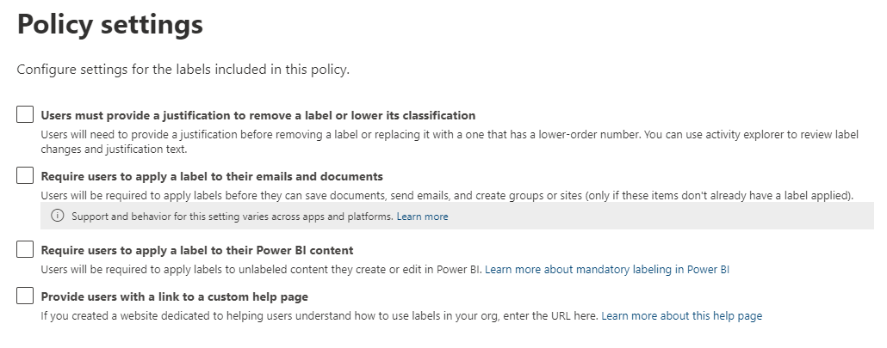

## Azure Information Protection 🛠️

Microsoft 365 Business Premium unlocks some of the core features of AIP, which later extends into some very impressive automated policies as you climb the licensing ladder all the way up to Microsoft 365 E5.

AIP is administered from [https://compliance.microsoft.com/](https://compliance.microsoft.com/informationprotection?viewid=sensitivitylabels)

### What is a label?

For files and emails that move between your company, a label can be applied to them which classifies the sensitivity of the information contained within. Depending on what your admin configures, the type of label you apply will also set some conditions to that item. For example, a label titled *Confidential* might encrypt whatever it is applied to. You can also apply a pre-configured watermark.

### What can be labelled?

- Files & Emails
- Groups & SharePoint Sites
- Azure Purview assets

### Example Scenario

You want a label that prevents the forwarding of emails which users can choose to apply when required. Your administrator has configured a label as shown below:

1. Create Label
2. Name: No Forward
3. Scope: Files & Emails
4. Encrypt Files and emails
5. Configure Encryption Settings
    1. Let Users assign permissions...
    2. In Outlook, enforce... Check: Do Not Forward
6. Finish

**Label Policy**

Created labels must be assigned to a policy before your users can access them. You can create a policy directly from your label. Any subsequent labels added will follow the policy rules.

>⚠️ Published policies take 24hrs to apply.

If you're dealing with particularly sensitive data, you can make it mandatory that users have to justify their actions.

[Learn more about labels](https://docs.microsoft.com/en-us/microsoft-365/compliance/sensitivity-labels?view=o365-worldwide)