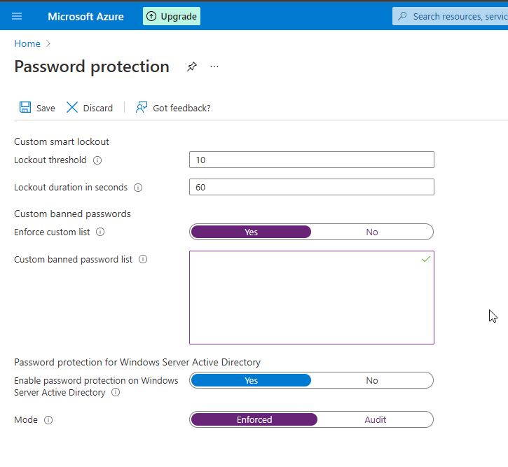

## Configure a Banned Passwords list ⛔

It is very easy to try and keep things simple in the workplace by setting a convenient password. For many people, that might be one that includes the company name or something else easily guessable if it is affiliated with the organization.

With Azure Password Protection you can specify a list of keywords which are automatically rejected when used in account passwords.

You can get to this via Azure AD -> All Services -> Azure AD Password protection

