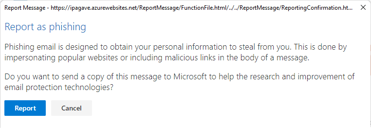

## Report Phishing add-in for Outlook 🔍

Training users to report phishing messages correctly is a great way to prevent malicious email  circulating in your company, and helps Microsoft to improve their spam detection success. There is a free add-in that you can deploy from the Microsoft Admin Portal which allows your users to do this.

### Enabling for all users

1. Go to: https://admin.microsoft.com/#/Settings/AddIns
2. Click Deploy add-in, choose from the store
3. Search for "Report Message"
4. Select the Microsoft one and follow the steps on-screen

Within 24 hours, users should see the button.

### What happens to those emails?

An admin can review all emails that users in the company have reported via the add-in. The admin also has the ability to dig deeper into the message and find out information such as contained links, and who else it was sent to.

[Learn more on MS Docs](https://docs.microsoft.com/en-us/microsoft-365/security/office-365-security/enable-the-report-message-add-in?view=o365-worldwide)