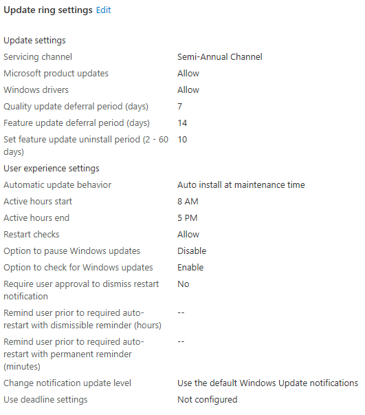
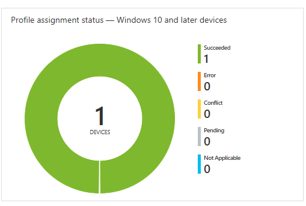

## Managing Windows Updates 🎭

Keeping your devices up-to-date is a key task for security maintenance, but also ensuring that all staff experience the same user space.

Windows 10 driver & patch management has come a long way since the XP days, and even if left alone will do a pretty good job by itself. Remember the days when you had to manually pre-load network drivers before you could get the rest?

It's also fair to say that managing a WSUS server was a constant struggle at the best of times, it was difficult to interpret the superseding changes and your devices had to have some way of communicating with your update delivery server. Luckily Intune makes this easier for us too.

### Configuring a ring 💍

Head to Devices -> Update rings for Windows 10 and later

A ring is a group of computers with a specific update policy.

You can pick from the following Windows 10 update channels:

- Semi-Annual Channel
- Windows Insider - Fast (Dev Channel)
- Windows Insider - Slow (Beta Channel)
- Windows Insider - Release Preview

For the vast majority of companies, you'll want to pick Semi-Annual Channel. This is the most stable ring of updates which should give you the fewest problems. If you have critical line of business apps from 3rd parties, you may wish to create a testing ring and assign some users to it. This is for the purpose of tackling small problems before they become big ones, before it goes out to the rest of your user base.

Once you've decided which ring, you are the choice of selecting and deferring certain update types. Personally I defer quality updates for 7 days and Feature updates for 14. I feel this gives a buffer if something goes hideously wrong on day 0.

Here's an example of a configured policy:

You'll be able to see the status of your updates too

For a basic ring, the above settings will be sufficient, learn more on [Docs](https://docs.microsoft.com/en-us/mem/intune/protect/windows-10-update-rings)